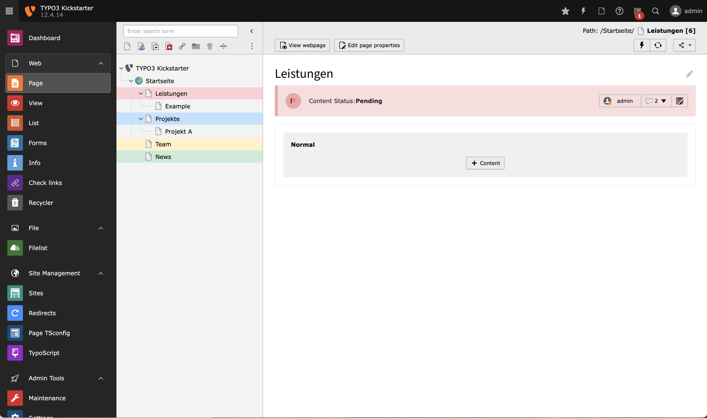

<div align="center">


# TYPO3 extension `xima_typo3_manual`

[](https://extensions.typo3.org/extension/xima_typo3_manual)

</div>

This extension provides a page status functionality to support the planning of content work, e.g. a migration process.

## Features

* Extended page properties for content status and additional comments
* PageTree quick status change
* Dashboard for content planning



## Requirements

* TYPO3 12.4 & PHP 8.1+

# Installation

### Composer

``` bash
composer require xima/xima-content-planner
```

# Usage

...


### Dashboard


## License

This project is licensed
under [GNU General Public License 2.0 (or later)](LICENSE.md).

