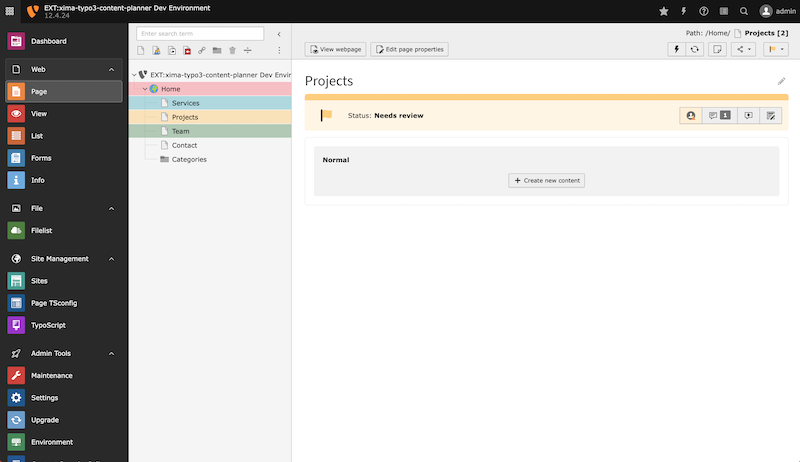
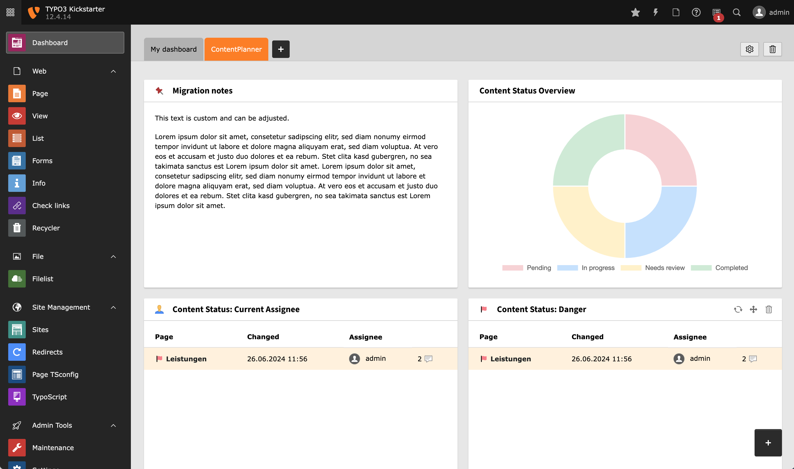

<div align="center">


# TYPO3 extension `xima_typo3_content_planner`

[](https://packagist.org/packages/xima/xima-typo3-content-planner)
[](https://extensions.typo3.org/extension/xima_typo3_content_planner)
[](https://extensions.typo3.org/extension/xima_typo3_content_planner)

</div>

This extension provides a page status functionality to support the planning of
content work, e.g. a migration process.



## Features

* Extended page properties for content status, assignee and additional comments
  * Colorful representation of the status within the backend
  * Easy change of status
  * User assignment for distribution of content work
  * Comments for additional information
* Extensive dashboard for detailed content planning
  * Custom notes for individual content planning
  * Recent updates widget for quick access to the latest changes
  * Filterable content planner record overview
* Extend additional database records with status behavior

## Requirements

* TYPO3 >= 12.4 & PHP 8.1+

## Installation

### Composer

``` bash
composer require xima/xima-typo3-content-planner
```

### TER

[](https://extensions.typo3.org/extension/xima_typo3_content_planner)

Download the zip file from [TYPO3 extension repository (TER)](https://extensions.typo3.org/extension/xima_typo3_content_planner).

## Usage

### Status

By default they are four different default status available:

- *Pending*: The page is not yet ready for editing.
- *In progress*: The page is currently being edited.
- *Needs review*: The page is ready for review.
- *Completed*: The page is ready to be published.

> **Hint**: The status are content generated on the root page. Add/remove/adjust them to fit your needs.

Change the page status easily:

- In the "Content Planner" tab within the page properties
- In the page tree context menu
- In the page backend header

Assign a user to the page to distribute the content work. >our own assignment is highlighted in the dashboard.

> **Hint**: By default the auto assignee feature is enabled. The assignee is automatically set to the current user when the status is changed from stateless to a new state.

Add some helpful comments within the page to support the content work.


### Dashboard

The dashboard provides an overview of the content status of all related records.
Use the "Content Planner" preset to easily create a new dashboard.
Add custom notes to the dashboard to influence the content planning.



## Configuration

Feature toggles are available, see `ext_localconf.php` for configuration options.

The content planner abilities are part of a **custom permission** and needed to be granted to the dedicated user group/s (except admins).

Every user can easily disable the content planner features in the user settings to avoid colour overload.

## Additional record tables

If you want to extend the content planner to other record tables (e.g. news), follow the steps below:

1. Extend the TCA (e.g. `Configuration/TCA/Overrides/tx_news_domain_model_news.php`):

```php
\Xima\XimaTypo3ContentPlanner\Utility\ExtensionUtility::addContentPlannerTabToTCA('tx_news_domain_model_news');
```

2. Extend the database fields (`ext_tables.sql`):

```sql
CREATE TABLE tx_news_domain_model_news
(
	tx_ximatypo3contentplanner_status   int(11) DEFAULT NULL,
	tx_ximatypo3contentplanner_assignee int(11) DEFAULT NULL,
	tx_ximatypo3contentplanner_comments int(11) unsigned default '0' not null,
);
```

3. Register the table in the `ext_localconf.php`:

```php
$GLOBALS['TYPO3_CONF_VARS']['EXTENSIONS']['xima_typo3_content_planner']['registerAdditionalRecordTables'][] = 'tx_news_domain_model_news';
```

## License

This project is licensed
under [GNU General Public License 2.0 (or later)](LICENSE.md).

Relax icons by Chattapat
from <a href="https://thenounproject.com/browse/icons/term/relax/" target="_blank" title="relax Icons">
Noun Project</a> (CC BY 3.0)
