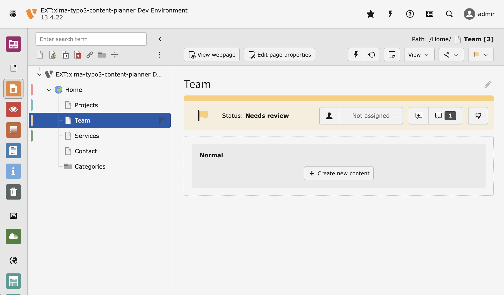

<div align="center">


# TYPO3 extension `xima_typo3_content_planner`

[](https://extensions.typo3.org/extension/xima_typo3_content_planner)
[](https://extensions.typo3.org/extension/xima_typo3_content_planner)
[](https://packagist.org/packages/xima/xima-typo3-content-planner)
[](https://github.com/xima-media/xima-typo3-content-planner/actions/workflows/cgl.yml)
[](https://github.com/xima-media/xima-typo3-content-planner/actions/workflows/tests.yml)
[](LICENSE.md)

</div>

This extension provides a page* status functionality to support the planning of
content work, e.g. a migration process.

(* also supports other records as well)



## ✨ Features

* Extended page properties for content **status**, **assignee** and additional **comments**
* Colorful representation of the status within the backend
* Easy change of status
* Backend user assignment for distribution of content work
* Comments with todo and resolve feature for additional information
* Extensive dashboard for detailed content planning
  * Recent updates widget for quick access to the latest changes
  * Filterable content planner record overview
* Extend additional database records with status behavior
  * Default support for content elements and files/folders in the file list

## 🔥 Installation

### Requirements

* TYPO3 13.4 LTS & 14.0+
* PHP 8.2+

### Supports

| **Version** | **TYPO3** | **PHP** |
|-------------|-----------|---------|
| 2.x         | 13-14     | 8.2-8.5 |
| 1.x         | 12-13     | 8.1-8.5 |

### Composer

[](https://packagist.org/packages/xima/xima-typo3-content-planner)
[](https://packagist.org/packages/xima/xima-typo3-content-planner)

``` bash
composer require xima/xima-typo3-content-planner
```

### TER

[](https://extensions.typo3.org/extension/xima_typo3_content_planner)
[](https://extensions.typo3.org/extension/xima_typo3_content_planner)

Download the zip file from [TYPO3 extension repository (TER)](https://extensions.typo3.org/extension/xima_typo3_content_planner).

## 📂 Setup

After the installation, update the database schema and setup the extension:

``` bash
vendor/bin/typo3 database:updateschema
vendor/bin/typo3 extension:setup --extension=xima_typo3_content_planner
```

## 📙 Documentation

Please have a look at the
[official extension documentation](https://docs.typo3.org/p/xima/xima-typo3-content-planner/main/en-us/Index.html).

## 🧑‍💻 Contributing

Please have a look at [`CONTRIBUTING.md`](CONTRIBUTING.md).

## 💎 Credits

Relax icons by Chattapat
from <a href="https://thenounproject.com/browse/icons/term/relax/" target="_blank" title="relax Icons">
Noun Project</a> (CC BY 3.0)

Thanks to [move:elevator](https://www.move-elevator.de/) and [XIMA](https://www.xima.de/) for supporting the development of this extension.

## ⭐ License

This project is licensed
under [GNU General Public License 2.0 (or later)](LICENSE.md).
