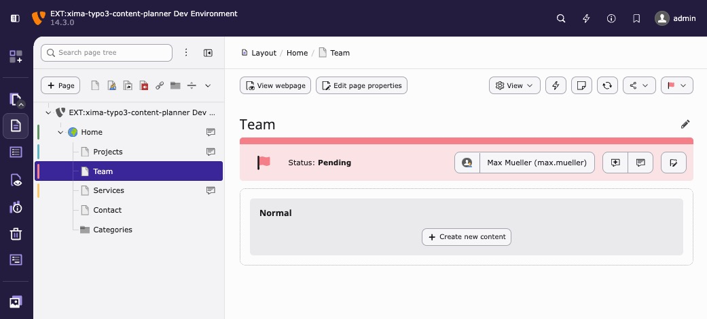

<div align="center">


# TYPO3 extension `xima_typo3_content_planner`

[](https://extensions.typo3.org/extension/xima_typo3_content_planner)
[](https://extensions.typo3.org/extension/xima_typo3_content_planner)
[](https://packagist.org/packages/xima/xima-typo3-content-planner)
[](https://coveralls.io/github/xima-media/xima-typo3-content-planner)
[](https://github.com/xima-media/xima-typo3-content-planner/actions/workflows/cgl.yml)
[](https://github.com/xima-media/xima-typo3-content-planner/actions/workflows/tests.yml)
[](LICENSE.md)

</div>

This TYPO3 extension adds content planning capabilities to the TYPO3 backend: assign a **status** to pages (and other records), **assign** responsible editors and leave **comments** with todos — all directly in the page tree, record list and file list.

> [!NOTE]
> Ideal for content migrations, editorial workflows or any process where you need to track who is working on what.



## ✨ Features

**[Status](https://docs.typo3.org/p/xima/xima-typo3-content-planner/main/en-us/Configuration/Status.html)** — Colorful, customizable status labels for pages and records
* [Change status](https://docs.typo3.org/p/xima/xima-typo3-content-planner/main/en-us/Usage/StatusChange.html) via page tree, module header, record list or edit form
* Bulk update multiple records at once or via [console command](https://docs.typo3.org/p/xima/xima-typo3-content-planner/main/en-us/Usage/Command.html)

**[Assignee](https://docs.typo3.org/p/xima/xima-typo3-content-planner/main/en-us/Usage/Assignee.html)** — Assign responsible editors to records
* Quick actions: "Assign to me" / "Unassign" shortcuts
* Optional auto-assignment on status change

**[Comments](https://docs.typo3.org/p/xima/xima-typo3-content-planner/main/en-us/Usage/Comments.html)** — Discuss records directly in the backend
* [Todos](https://docs.typo3.org/p/xima/xima-typo3-content-planner/main/en-us/Usage/Comments.html#todos) and [resolution](https://docs.typo3.org/p/xima/xima-typo3-content-planner/main/en-us/Usage/Comments.html#resolution) tracking within comments
* [Threaded replies](https://docs.typo3.org/p/xima/xima-typo3-content-planner/main/en-us/Usage/Comments.html#threaded-replies) and [shareable links](https://docs.typo3.org/p/xima/xima-typo3-content-planner/main/en-us/Usage/Comments.html#share-link)

**[Dashboard](https://docs.typo3.org/p/xima/xima-typo3-content-planner/main/en-us/Usage/Dashboard.html)** — Ready-to-use dashboard preset with dedicated widgets
* Overview, status, updates, assignee, todo, comments widgets
* [Configurable widget](https://docs.typo3.org/p/xima/xima-typo3-content-planner/main/en-us/Usage/Dashboard.html#configurable-widget) with custom filters (TYPO3 v14+)

**Extensibility** — Works beyond pages
* Extend [additional database records](https://docs.typo3.org/p/xima/xima-typo3-content-planner/main/en-us/DeveloperCorner/AdditionalRecords.html) with status behavior
* Built-in support for content elements and [files/folders](https://docs.typo3.org/p/xima/xima-typo3-content-planner/main/en-us/Usage/Filelist.html)

## 🔥 Installation

### Requirements

* TYPO3 13.4 LTS & 14.0+
* PHP 8.2+

### Supports

| **Version** | **TYPO3** | **PHP** |
|-------------|-----------|---------|
| 2.x         | 13-14     | 8.2-8.5 |
| 1.x         | 12-13     | 8.1-8.5 |

### Composer

[](https://packagist.org/packages/xima/xima-typo3-content-planner)
[](https://packagist.org/packages/xima/xima-typo3-content-planner)

``` bash
composer require xima/xima-typo3-content-planner
```

### TER

[](https://extensions.typo3.org/extension/xima_typo3_content_planner)
[](https://extensions.typo3.org/extension/xima_typo3_content_planner)

Download the zip file from [TYPO3 extension repository (TER)](https://extensions.typo3.org/extension/xima_typo3_content_planner).

## 📂 Setup

After the installation, update the database schema and setup the extension:

``` bash
vendor/bin/typo3 database:updateschema
vendor/bin/typo3 extension:setup --extension=xima_typo3_content_planner
```

## 📙 Documentation

Please have a look at the
[official extension documentation](https://docs.typo3.org/p/xima/xima-typo3-content-planner/main/en-us/Index.html).

## 🧑‍💻 Contributing

Please have a look at [`CONTRIBUTING.md`](CONTRIBUTING.md).

## 💎 Credits

Relax icons by Chattapat
from <a href="https://thenounproject.com/browse/icons/term/relax/" target="_blank" title="relax Icons">
Noun Project</a> (CC BY 3.0)

Thanks to [move:elevator](https://www.move-elevator.de/) and [XIMA](https://www.xima.de/) for supporting the development of this extension.

## ⭐ License

This project is licensed
under [GNU General Public License 2.0 (or later)](LICENSE.md).
