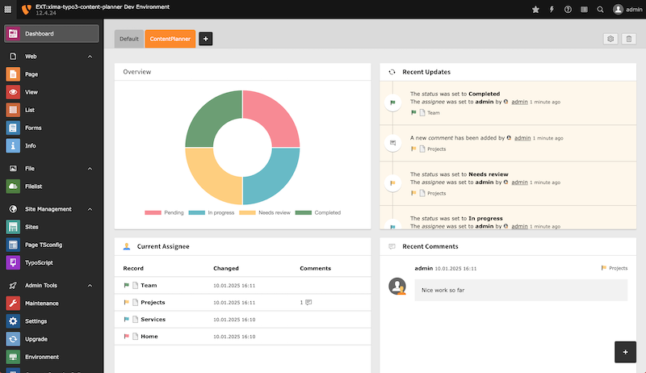

<div align="center">


# TYPO3 extension `xima_typo3_content_planner`

[]()

</div>

This extension provides a page status functionality to support the planning of
content work, e.g. a migration process.

## Features

* Extended page properties for content status, assignee and additional comments
* Extensive dashboard for detailed content planning
* Recent updates widget for quick access to the latest changes


## Requirements

* TYPO3 12.4 & PHP 8.1+

# Installation

### Composer

``` bash
composer require xima/xima-typo3-content-planner
```

# Usage

## Status

By default they are four different status available:

- *Pending*: The page is not yet ready for editing.
- *In progress*: The page is currently being edited.
- *Needs review*: The page is ready for review.
- *Completed*: The page is published.

> **Hint**: Rename the status by overriding the translation to fit your needs.

Change the page status:

- In the "Content Planner" tab within the page properties
- In the page tree context menu
- In the page backend header


## Dashboard

The dashboard provides an overview of the content status of all related  pages.
Use the "Content Planner" preset to easily create a new dashboard.
Add custom notes to the dashboard to influence the content planning.



# Configuration

The content planner abilities are part of a custom permission and needed to be granted to the dedicated user group(s) (except admins).

Every user can disable the content planner features in the user settings.

## License

This project is licensed
under [GNU General Public License 2.0 (or later)](LICENSE.md).

Relax icons by Chattapat
from <a href="https://thenounproject.com/browse/icons/term/relax/" target="_blank" title="relax Icons">
Noun Project</a> (CC BY 3.0)
